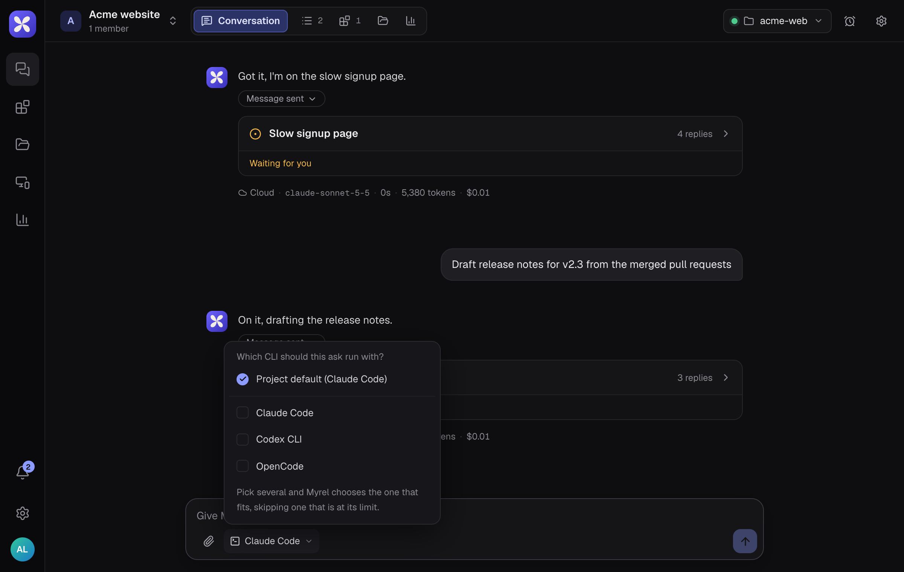

On your computer, tasks run through a coding CLI you already have.

| CLI | Command | Can ask you mid-task | Notes |
|---|---|---|---|
| Claude Code | `claude` | Yes | Asks before opening other folders or running commands it isn't allowed to |
| Codex CLI | `codex` | Yes | Asks before a command or file its sandbox doesn't allow (for example `git push`). Needs a Codex with `codex app-server` |
| Antigravity CLI | `agy` | No | A step that needs approval ends the run, which then says what stopped it |
| OpenCode | `opencode` | No | Doesn't run shell commands below **Full access** |
| Hermes Agent | `hermes` | No | Needs `hermes pm install --extra acp` once |
| Cursor CLI | `cursor-agent` | No | Below **Full access**, commands run in Cursor's sandbox, without network |
| Muse Code | `muse` | No | Below **Full access**, it writes only in the project's main folder |
| Kimi Code | `kimi` | No | Doesn't run shell commands below **Full access** |
| Qwen Code | `qwen` | No | Doesn't run shell commands below **Full access** (with **Auto**, its own safety check decides). Runs on the model set in Qwen Code. Needs runner 0.39.0 or newer |

Install the CLI and sign in to it before you pair the computer. CLIs that can't ask mid-task stay inside the project's folders, so add any folder they need under **Also allowed** ([Folders](/computer/folders/)).

## The project's default

When you give a project its folder, you pick its **Coding CLI**. Every task uses it unless you choose otherwise.

## Pick a CLI for one ask

The CLI button under **Give Myrel a task** shows which CLI the next ask will use.



- **Project default** uses the project's CLI.
- Tick one CLI to use it for this ask.
- Tick several and Myrel picks the one that fits the task, skipping one that is at its limit. The thread then says which one it picked and why.

## Change it for a thread

In a thread, one button under the message box sums up how it works, for example **Claude Code · Opus · High**. It opens **How this thread works**, with everything in one place:

- **Works on**: the project's default computer, another of your computers in the project, or **Cloud**.
- **CLI**: the project's default or one of the CLIs installed there.
- **Model** and **Effort**: for a CLI that lists its models. **Project default** uses the project's choice for that CLI; effort offers only the levels the model takes.

The panel stays open while you pick, so you can switch the CLI and then pick its model. Changes apply from the thread's next turn.

Only the person whose computer the thread works on can change these; others see the same button read-only. In the cloud, any member can pick the CLI and the project's model runs.

## More than one Claude Code account

If you have two Claude Code logins, for example a personal one and one from work, the computer can keep both and each thread picks one. Add the second on the computer:

```sh
npx myrel-runner claude add "Work"
npx myrel-runner claude rename default "Personal"
```

`claude add` opens Claude Code's own sign-in in a folder of its own (`~/.myrel-runner/claude/work`). The login stays in that folder: neither the runner nor Myrel reads or keeps it. `rename default` names the login you already had. `npx myrel-runner claude list` shows each account and whether it is signed in, `claude login "Work"` signs in again, and `claude remove "Work"` forgets one.

Then:

- **How this thread works** lists **Claude Code · Personal** and **Claude Code · Work** under **CLI**, each with how much of its 5-hour limit is used.
- **Project settings › Models on the computer** sets which account the project's threads use by default.
- **Project settings › Model › Coordinator** sets which account the coordinator uses, when it works with Claude Code on that computer.
- **Devices** shows each account's limits on its own.

A thread that switches accounts starts a new Claude Code session, with the thread's history. A new account has none of your `~/.claude` settings or plugins. If an account is removed from the computer, the thread's next turn runs with Claude Code's own login and says so. Use accounts that are all yours: Claude's terms don't allow sharing a login with someone else. Needs runner 0.34.0 or newer.

## GLM with OpenCode

[Z.ai's GLM Coding Plan](https://docs.z.ai/devpack/overview) works with OpenCode, so your threads can run on GLM models with your own plan. On the computer:

1. Install [OpenCode](https://opencode.ai) 2.x.
2. Run `opencode auth login zai-coding-plan` and paste a key made for the Coding Plan. Plan keys and Z.ai's pay-as-you-go keys are separate: a pay-as-you-go key is billed to your balance, not your plan.
3. Run `opencode models` and check that it lists `zai-coding-plan/…` models.
4. Restart the runner so Myrel reads the list again (it also does so every 6 hours).

Then pick **OpenCode** and a model that starts with `zai-coding-plan/` in **How this thread works**, or as the project's default in **Project settings › Models on the computer**. Models that start with `zai/` use Z.ai's pay-as-you-go API instead.

- Sign in with that command rather than setting `ZHIPU_API_KEY` in the runner's environment: commands a thread runs with **Full access** can read that variable.
- As for every OpenCode thread, shell commands need **Full access** and it can't ask you mid-task.
- Myrel shows no plan limits for it; see your usage on Z.ai.
- Z.ai's terms allow the plan only in [the tools it supports](https://docs.z.ai/devpack/tool/others), for one person. Don't share your key with others.

## The coordinator on your CLI

The coordinator, which routes every message in the project chat, normally works with the server's model. You can have it work with Claude Code on your own computer instead, in **Project settings › Model › Coordinator**:

- **Works with**: **A CLI on my computer**. Then pick the **Computer** (one of yours that has the project's folder), the **CLI**, and its **Model** and **Effort** from the CLI's own list. These show only while a CLI is picked.
- **Account**: when the computer has [more than one Claude Code account](#more-than-one-claude-code-account), which one pays for the coordinator's turns. Without a pick it uses Claude Code's own login, and an account later removed from the computer falls back to it too.
- Each coordinator turn then runs on that computer with your subscription, and any member's message starts one. Myrel shows no cost for them.
- The CLI gets none of its own tools: no commands, files or web, whatever the computer's access level. It works in an empty folder of its own, with only Myrel's coordinator tools, and starts a fresh session each turn.
- When it cannot answer (the computer is offline, the runner is too old, the CLI fails or is at its limit), the server's model answers that turn. A CLI turn that already did something and then stopped is not repeated; the chat says it stopped.

Only the computer's owner turns this on or changes it. Other owners and admins see whose computer it runs on and can switch it back to the server's model. Only Claude Code can do this for now, since it can run without its own tools. Needs runner 0.38.0 or newer.

## Usage limits

For Claude Code and Codex, **Devices** shows how much of the 5-hour and weekly limits you have used, for each Claude Code account on its own. The CLI picker marks a CLI **near its limit** or **at its limit**.
